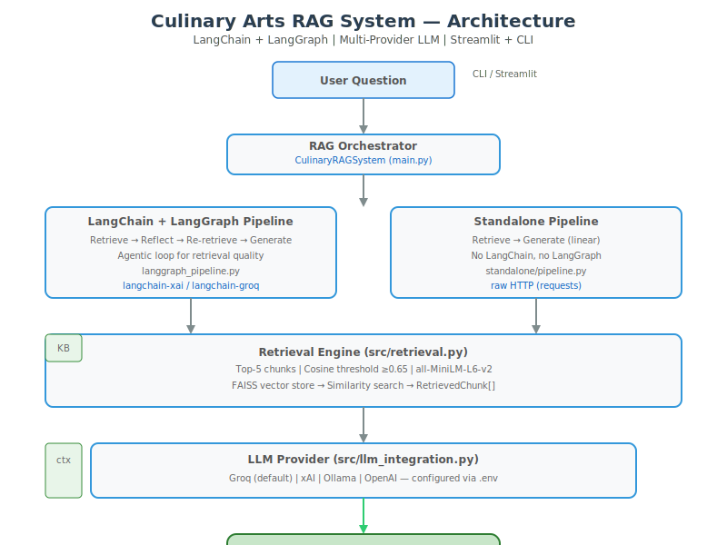

# Culinary Arts RAG Assistant 🍳

[](https://github.com/MohamedGhoniem11/KBAI-project/actions)
[](https://www.python.org/)
[](https://streamlit.io/)
[](https://www.langchain.com/)
[](LICENSE)
[](#provider-architecture)
[](https://www.docker.com/)

> **AI-powered culinary knowledge base with multi-provider LLM support, citation-anchored generation, and dual retrieval pipelines (LangChain + Standalone).**

---

## Architecture



```
User (CLI / Streamlit)
        │
        ▼
┌───────────────────────────────────┐
│      RAG Orchestrator             │
│  (main.py / app.py)               │
└────────────┬──────────────────────┘
             │
     ┌───────┴───────┐
     ▼               ▼
┌──────────┐   ┌──────────┐
│ LangChain│   │Standalone│
│ LangGraph│   │(linear)  │
│ agentic  │   │ pure Py  │
└────┬─────┘   └────┬─────┘
     └───────┬───────┘
             ▼
┌───────────────────────┐
│   Retrieval Engine    │
│  FAISS · Top-5 · ≥0.65│
└───────────┬───────────┘
             ▼
┌───────────────────────┐
│  LLM Provider Layer   │
│ Groq · xAI · Ollama   │
└───────────┬───────────┘
             ▼
┌───────────────────────┐
│  Grounded Answer      │
│  + Citations          │
│  + Disclaimer (FR-07) │
└───────────────────────┘
```

### Dual Pipeline Design

| Feature | LangChain + LangGraph | Standalone (Pure Python) |
|---------|----------------------|--------------------------|
| **Pipeline** | Agentic: retrieve → reflect → re-retrieve → generate | Linear: retrieve → generate |
| **LLM SDK** | `langchain-groq` / `langchain-xai` | Raw HTTP (requests) |
| **Dependencies** | LangChain, LangGraph, langchain-X | Zero LangChain dependency |
| **When to use** | Production / demonstration | Minimal dependency showcase |

---

## Features

### Core RAG (FR-01 to FR-07)

| Req | Feature | Status |
|-----|---------|--------|
| FR-01 | Free-form natural language query | ✅ CLI + Streamlit |
| FR-02 | all-MiniLM-L6-v2 embeddings | ✅ Justified in config |
| FR-03 | Top-5 retrieval, cosine ≥0.65 | ✅ Configurable |
| FR-04 | Grounded generation (no hallucination) | ✅ LLM constrained to context |
| FR-05 | Inline citations with page numbers | ✅ [Source X] format |
| FR-06 | Add documents without retraining | ✅ FAISS append |
| FR-07 | Domain disclaimer on every response | ✅ Automatic append |

### Provider Architecture (NEW)

Switch LLM providers via environment variable without changing code:

```bash
# Default: Groq (free, fast)
LLM_PROVIDER=groq
GROQ_API_KEY=gsk_your_key_here

# xAI
LLM_PROVIDER=xai
XAI_API_KEY=xai_your_key_here

# Local Ollama
LLM_PROVIDER=ollama
# No API key needed — runs local models
```

Provider fallback: If API call fails, returns retrieved chunks as sources (graceful degradation).

---

## Quick Start

### Prerequisites

- Python 3.10+
- [Groq API key](https://console.groq.com) (free) or [xAI API key](https://console.x.ai/)

### 1. Setup

```bash
git clone https://github.com/MohamedGhoniem11/KBAI-project.git
cd KBAI-project
make install
```

### 2. Configure

```bash
cp .env.example .env
# Edit .env — set your API key
```

### 3. Download Knowledge Base

```bash
# Option A: Auto-download (requires ~272MB)
unzip KB.zip -d KB/   # or use the Google Drive link in README

# Option B: Add your own PDF/DOCX files to KB/
```

### 4. Build Vector Store

```bash
make rebuild
```

### 5. Run

```bash
# Streamlit web UI
make run

# CLI mode
make run-cli
```

---

## Project Structure

```
├── src/                      # LangChain + LangGraph pipeline
│   ├── config.py             # Thresholds, paths, disclaimer
│   ├── ingestion.py          # PDF/DOCX loading + chunking
│   ├── embeddings.py         # HuggingFace embeddings
│   ├── vectorstore.py        # FAISS management
│   ├── retrieval.py          # Semantic retrieval (top-5, ≥0.65)
│   ├── langgraph_pipeline.py # Agentic graph (reflect + re-retrieve)
│   ├── llm_integration.py    # Multi-provider LLM
│   ├── provider.py           # Provider abstraction layer
│   └── logging_config.py     # Logging setup
├── standalone/               # Pure-Python pipeline (no LangChain)
│   ├── config.py             # Standalone config
│   ├── embeddings.py         # Standalone embeddings
│   ├── ingestion.py          # Standalone ingestion
│   ├── vectorstore.py        # Standalone FAISS
│   ├── retrieval.py          # Standalone retrieval
│   ├── llm_integration.py    # Standalone multi-provider LLM
│   └── pipeline.py           # Standalone RAG orchestrator
├── app.py                    # Streamlit web UI
├── main.py                   # CLI entry point
├── rebuild_and_test.py       # Vector store builder
├── Dockerfile                # Container build
├── docker-compose.yml        # Container orchestration
├── Makefile                  # Dev commands
├── pyproject.toml            # Python config + ruff linting
└── requirements.txt          # Dependencies
```

---

## Commands

| Command | Description |
|---------|-------------|
| `make install` | Create venv + install dependencies |
| `make run` | Launch Streamlit UI |
| `make run-cli` | Run CLI test queries |
| `make rebuild` | Rebuild FAISS vector store |
| `make lint` | Ruff code linting |
| `make format` | Auto-format code |
| `make test` | Verify system initialization |
| `make clean` | Remove venv + caches |
| `make docker-build` | Build Docker image |
| `make docker-up` | Start Docker Compose |
| `make docker-down` | Stop Docker Compose |

---

## Deployment

### HuggingFace Spaces (Recommended)

1. Create Space at [huggingface.co/new-space](https://huggingface.co/new-space)
2. SDK: **Streamlit**
3. Push code + set secrets:
   - `GROQ_API_KEY` or `XAI_API_KEY`
   - `LLM_PROVIDER` = `groq`

### Streamlit Cloud

1. Fork repo to GitHub
2. Deploy at [share.streamlit.io](https://share.streamlit.io)
3. Set Streamlit secrets with API key

### Docker

```bash
make docker-build
make docker-up
# Open http://localhost:8501
```

---

## CV / Portfolio Value

| Skill | What This Proves |
|-------|-----------------|
| **RAG Architecture** | Full retrieval-augmented generation pipeline |
| **LLM Integration** | Multi-provider support (Groq, xAI, Ollama) |
| **LangChain + LangGraph** | Agentic retrieval pipeline with reflection |
| **Vector Databases** | FAISS with cosine similarity thresholding |
| **Streamlit** | Interactive web UI for ML applications |
| **Docker** | Containerized deployment |
| **Code Quality** | CI/CD, linting, type hints, logging |

---

## License

Apache 2.0

---

## Requirements Map

| Requirement | File | Status |
|-------------|------|--------|
| FR-01: Natural Language Query | `app.py`, `main.py` | ✅ |
| FR-02: Embedding Justification | `src/config.py` | ✅ |
| FR-03: Top-5 + 0.65 Threshold | `src/config.py`, `src/retrieval.py` | ✅ |
| FR-04: Grok-only Generation | `src/llm_integration.py` | ✅ (now multi-provider) |
| FR-05: Inline Citations | `src/llm_integration.py` | ✅ |
| FR-06: Add Documents | `main.py` (add_document) | ✅ |
| FR-07: Domain Disclaimer | `src/config.py` → auto-append | ✅ |